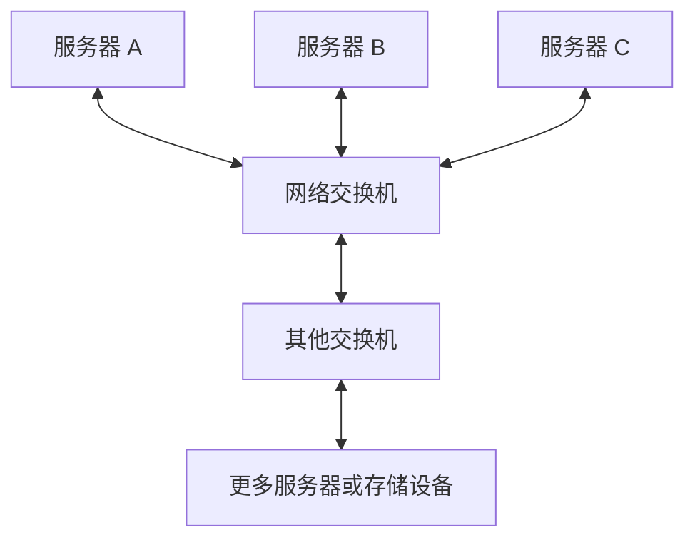
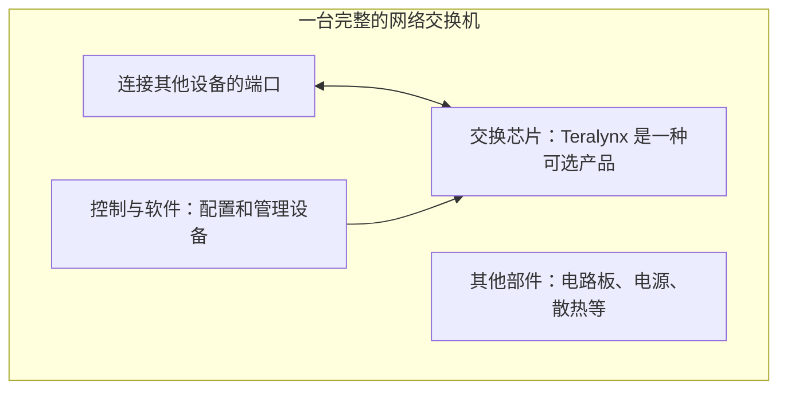

# 从零认识 Marvell：它的芯片在数据中心里做什么？

[返回学习地图](../README.md) · **建议作为第一篇阅读，约 15–20 分钟。**

这篇从“服务器是什么”开始。读完后，你应能解释：数据中心为什么需要交换机，Marvell 的产品装在哪里，谁会买它们，以及为什么研究交换机市场时要先分清“整台设备”和“里面的芯片”。产品型号和技术参数可以留到后续章节。

**先记住一句话：Marvell 为数据中心提供关键芯片，帮助计算设备交换数据，也提供定制计算、存储等相关芯片。你通常看不到它的品牌，但它的产品可能装在你使用的云服务背后的设备里。** 公司在纳斯达克上市，股票代码 MRVL。[公司年报][annual] [官网产品分类][home]

## 1. 先走进机房：数据中心里到底有什么？

你用手机打开网页、观看视频或向 AI 提问时，一部分工作在手机上完成，另一部分由远方的计算机完成。集中放置这些计算机，并提供供电、散热和通信条件的设施，就是数据中心。

先从小到大认识四个层级：

| 层级 | 可以怎样理解 | 举例 |
|---|---|---|
| 芯片 | 承担特定工作的微型电子部件 | 做运算的芯片、处理网络数据的芯片 |
| 设备 | 把芯片、电路板、电源等装在一起，形成能工作的机器 | 服务器、网络交换机 |
| 机柜 | 用来安装多台设备的金属柜架 | 一个柜子里可以装服务器，也可以装网络设备 |
| 数据中心 | 容纳许多机柜，并配套电力、散热和网络的设施 | 云服务商运行计算任务的机房 |

**服务器就是专门向其他计算机或用户提供服务的计算机。** 它和你的电脑有不少共同点，只是更重视持续运行、可靠性以及同时处理大量任务。

一台服务器里，先认识这几样东西：

- **CPU：通用处理器。** 运行程序、调度任务，处理各种通用计算。
- **GPU：擅长大量并行计算的处理器。** 很多 AI 任务包含大量适合它执行的数学运算；并非每台服务器都有 GPU。
- **内存：正在工作的临时空间。** 可以类比桌面，摆着当前要处理的材料。
- **硬盘／SSD：长期存放数据的地方。** 可以类比文件柜；SSD 是固态硬盘。
- **网卡：服务器接入网络的部件。** 帮它向外发送和接收数据，资料里常写作 NIC。

所以，一颗 GPU、一台服务器、一个机柜，代表三个不同的数量单位。后面做市场规模时，这个区别非常重要。

## 2. 用一次 AI 提问，理解“计算”和“搬数据”

假设你向 AI 提问：“帮我总结这篇文章。”下面是一条简化的处理过程，不代表某一家服务商的实际部署：

1. **问题被送进数据中心。** 服务入口收到请求，把任务交给合适的计算设备。
2. **计算设备准备所需内容。** 使用模型和输入数据开展计算；部分内容可能已经在内存中，无需每次重新从硬盘读取。
3. **一台或多台设备完成任务。** 小任务可能由单个计算设备完成；较大的模型或任务可能由多块 GPU 分工处理。
4. **结果通过网络送回你的手机。**

这里有两种不同的工作：**计算设备负责“算出结果”，网络负责“让所需数据及时到达”。**

如果参与计算的 GPU 分散在多台服务器里，它们还需要互相传递数据。可以把它理解成一个团队共同完成报告：每个人算得很快，但如果交换材料很慢，整体仍然会慢。这个比喻只解释分工，实际传输的是电子或光信号。

因此，AI 数据中心增加 GPU 后，常常还要升级连接它们的网络。采购者希望昂贵的计算设备少等数据、多做有效工作。

顺便分清后文两个词：**训练**是利用数据调整模型；**推理**是用已经训练好的模型处理新请求。上面的提问属于推理，两者都可能需要多台设备协作，但通信需求并不完全一样。

## 3. 交换机为什么会出现在这里？

两台计算机可以直接连起来。但如果很多服务器都要互相通信，每两台之间都拉一根专用线，会很难扩展和管理。

**网络交换机是一台把多台设备连接起来，并把收到的数据转发到合适出口的设备。** 外观可以先想成一个有很多插口的金属盒子。这些连接口叫“端口”。数据中心交换机一般通过铜缆或光纤连接设备。

数据通常被拆成一个个小块传输，称为“数据包”，其中带有目的地等信息。交换机根据这些信息和已有规则选择出口；出口忙时，数据可能需要排队。

例如，服务器 A 要把计算结果交给服务器 C，数据可以先进入交换机，再从通往 C 的端口发出去。实际大型网络通常要经过多台交换机，不是全机房共用一个盒子。

你将在资料里看到“**以太网**”：先把它理解成一种广泛使用的网络通信规则。设备要按相容的规则发送和接收，才能正常交流。它也可以通过光纤连接，并不只指家里常见的网线。

你原来电力笔记里的**开关设备**负责分配、接通、隔离或保护电力；这里的**网络交换机**负责转发数据。看到英文 switch 时，要先确认谈的是哪一种。

## 4. 打开交换机外壳，才会看到 Marvell 所处的位置

一台完整交换机里，有电路板、芯片、电源、散热部件和接口，还需要软件让它按规则运行。

其中承担高速数据转发的核心部件，叫**交换芯片**。它需要快速判断数据往哪里走，并管理转发和排队等工作。

**Marvell 的 Teralynx，就是这类以太网交换芯片的一个产品家族。** 设备厂商可以围绕它设计完整交换机。官网有时直接把这类芯片称为 switch，阅读时要留意上下文中的产品层级。[Marvell 交换产品页][switch]

现在可以读懂后文的 **“交换 ASIC”** 了。ASIC 的意思是“面向特定用途设计的芯片”，交换 ASIC 就是专门做交换工作的芯片。**ASIC 这个词本身，不代表一定是为某一个客户单独定制。**

如果有人说“数据中心买了一台交换机”，这笔采购金额还包含其他部件、软件和整机厂商的价值。它不等于 Marvell 卖出交换芯片的收入。具体整机也可能使用其他公司的芯片，或包含多颗交换芯片。

**想再往芯片里看一层？** 数据需要先通过高速接口进出芯片，再由内部逻辑决定出口。你可能会遇到 SerDes、PHY、纠错和缓存等名字，它们各有分工。新增的[《拆开交换芯片》](02a_inside_switch_chip.md)从 0 和 1 如何变成信号开始解释；可以先读完本篇，再去看这一节。

## 5. 数据选对了出口，还要能顺利传过去

现在沿着一条简单连接看一次：

**服务器里的处理器 → 网卡 → 铜缆或光纤连接 → 交换机 → 另一条连接 → 另一台服务器的网卡。**

网卡让服务器收发网络数据，交换机连接多个设备并转发数据；它们处在不同位置。

如果使用光纤，常见方案是在链路两端安装**光模块**。这是负责收发光信号的小部件：发送端把电信号转换为光信号，接收端再转换回来。可插拔光模块常安装在网络设备的端口处。

传输速度越高，信号失真、噪声等问题越难处理。一些光模块会使用**DSP，即数字信号处理芯片**，帮助处理高速传输中的信号。Marvell 的 **Spica、Nova、Ara** 属于光互连 DSP 产品家族。[Marvell 光 DSP 产品页][dsp]

这就解释了 Marvell 的两种不同角色：

| 遇到的问题 | 主要看哪类芯片 | 你可以记成 |
|---|---|---|
| 多台设备发来的数据应该从哪个出口走？ | 交换芯片，例如 Teralynx | 负责数据转发 |
| 高速连接上的信号怎样才能可靠传输？ | 信号处理芯片，例如光 DSP | 帮助信号传输 |

DSP 不是整个光模块，也不独自完成全部光电转换。不同光连接方案使用的器件组合也不同，不能假定每个光模块都含有独立 DSP。

所以，**即使一台交换机的主交换芯片来自别家，它使用的光模块里仍可能有 Marvell 的芯片。** 是否实际采用，要查具体设备和模块的配置。

## 6. 把 Marvell 的其他产品也放进这幅图

先抓住上面的“交换”和“信号传输”，再看另外几类。这里是帮助入门的产品地图，不是公司收入占比排序，也不是完整产品目录。

| 你已经理解的需求 | Marvell 对应的产品方向 | 装在哪里、做什么 |
|---|---|---|
| 让很多设备互相交换数据 | Teralynx 交换芯片 | 在网络交换机里承担转发工作 |
| 让光连接可靠传输高速信号 | Spica／Nova／Ara 光 DSP | 用于光模块中的信号处理 |
| 客户希望按自己的需求设计计算等芯片 | Custom ASIC，定制芯片业务 | 与客户协作设计专用芯片，可涉及 AI 计算等用途 |
| 让处理器、加速器等部件连接起来，或接入更多内存 | Structera 等连接与内存相关芯片 | 用于设备连接、内存扩展或内存资源池等方案 |
| 让固态硬盘可靠读写数据 | SSD 控制器 | 在固态硬盘中管理数据读写等工作 |

上述产品分类依据 Marvell 的[交换][switch]、[光 DSP][dsp]、[定制芯片][custom]、[内存相关产品][cxl]与[SSD 控制器][ssd]资料。

“定制芯片”可以类比按客户需求设计专用机器：客户提出工作目标，Marvell 提供相关设计与实现能力，具体分工因项目而异。**交换芯片和定制计算芯片都可能叫 ASIC，但用途和业务范围不同。**

Structera 相关资料里还会出现两个名字，先认识用途即可：**PCIe** 是连接处理器、加速器、网卡、硬盘等部件的常见技术；**CXL** 是可用于处理器、设备与内存之间连接的技术，后文重点关注它带来的内存扩展与资源池。对应的交换产品要与以太网交换产品分开理解。[交换产品][switch] [CXL 产品][cxl]

如果后面看到 **retimer（重定时器）**，可以先记成帮助高速电信号恢复质量的器件。Marvell 的 Alaska P 是 PCIe retimer 产品家族，它不承担网络交换芯片那样的出口选择工作。[PCIe retimer 产品页][retimer]

## 7. 谁会买这些芯片，为什么愿意付钱？

你购买的是 AI 应用或云服务；数据中心运营方采购的是能运行服务的基础设施。Marvell 所在的芯片供应环节，通常在更上游。

以交换芯片为例，一条简化的价值链是：

**Marvell 等芯片供应商 → 设计或制造交换机的厂商 → 使用这些设备的云服务商、企业等 → 使用最终服务的用户。**

光 DSP 则可能先进入光模块，再随着模块进入网络系统。实际业务里，大型客户也可能直接参与芯片选型、定制设计和采购；上面的顺序解释产品怎样进入系统，不代表每笔交易都经过同样的中间商。

这些客户购买产品，是为了让系统更有效地工作。他们会关心：能连接多少设备、能搬多少数据、等待多久、是否可靠、耗电多少，以及软件是否容易使用。

因此，后续看到技术升级时，可以先问一个朴素的问题：**这个改进，是让同样多的机器更快完成工作，还是让同样的任务少耗电、少用设备？** 有了这一层理解，带宽、时延、功耗就不再是一堆孤立参数。

## 8. 接上你已经学过的供电、散热和 800VDC

你原来的笔记解决的是：**电如何送到设备，设备产生的热如何带走。** 现在补上的是：**设备之间的数据如何传递。**

可以把一个数据中心的正常工作理解成三个条件同时成立：

- 供电系统能持续提供设备需要的电。
- 散热系统能带走设备工作时产生的热。
- 计算、存储和网络设备能协同完成任务。

Marvell 的交换与互连产品，主要帮助第三件事。它们自身也耗电、发热，所以低功耗设计又会影响前两件事。

**800VDC 里的 V 是伏特，讲供电电压；800G 网络里的 G 通常指每秒十亿比特，讲数据传输速率。** 800G 不是 800GB 的存储容量，也不代表 800V 供电。前者在网络语境下通常表示 800Gb/s，后者是在描述电力系统。

这能帮助你理解为什么两个行业会同时受 AI 建设推动，但不能用“建设了多少兆瓦机房”直接乘出交换芯片市场：同样的供电容量下，设备类型、连接方法和采购节奏都可能不同。完整衔接放在[电力散热笔记整合](05_notes_bridge.md)。

## 9. 后续章节的几个词，现在可以怎样读？

不需要背英文全称。遇到时先翻译成右边的意思：

| 后文用词 | 入门时的理解 |
|---|---|
| 带宽 | 一段时间内最多能传多少数据；像道路的通行能力 |
| 时延 | 一次传输或处理需要等待多久；和“最多能传多少”是两件事 |
| 前端网络 front-end | 把请求、业务数据和服务连接起来的网络；不是网页界面的“前端开发” |
| AI 后端网络 back-end | 重点服务于 AI 计算设备之间协作通信的网络；具体范围要看架构 |
| scale-up | 让一组计算资源更紧密地合作，像扩大一个协作紧密的小组 |
| scale-out | 把更多计算节点或小组连接成更大的集群；集群就是协同工作的多台设备 |
| DCI | 数据中心之间的互连，连接距离和需求与机房内可能不同 |
| 端口速率／芯片总交换容量 | 前者看一个连接口的能力，后者看整颗芯片的整体能力，不能当成同一个数 |

scale-up 和 scale-out 按协作方式区分，并非严格按“机柜内／机柜外”划线。上表用于建立直觉，后续章节会解释实际架构中的区别。

例如，“采用 Marvell Teralynx 的 800G 以太网交换机”，现在可以拆成：**一台网络设备，使用 Marvell 的交换芯片，提供标称 800Gb/s 的以太网端口。** 这句话没有告诉你用了多少端口，也没有告诉你芯片和整机各卖多少钱。

## 10. 带着这个基础，开始后面的研究

先看一个纯粹的口径例子，数字不代表实际配置或市场预测：假设某个项目采购 100 台交换机，每台恰好使用 1 颗目标交换芯片。这个项目对应 **100 台整机需求、100 颗该芯片需求**，但两者对应的收入不同。

如果研究的是 Marvell 交换芯片机会，还要进一步知道：哪些设备能使用它、客户最终选哪家供应商、成交价和交货年份是什么。光 DSP、定制芯片等产品要另看数量与价格，不能一起套用“100 台交换机”这个分母。

所以，和 Marvell 开场时，可以先用一句容易理解的话确认需求：

> “我们想先确认，这次您关注的是网络交换机里面的交换芯片，还是也包括光模块里的信号处理芯片，以及其他类型的连接产品？”

继续之前，试着回答四个问题：

1. **Marvell 的 Teralynx 通常在数据中心的什么位置？** —— 在网络交换机中，承担数据转发工作的芯片位置。
2. **GPU 已经很快，为什么还需要升级网络？** —— 多设备协作需要交换数据，传输慢会让计算设备等待。
3. **光模块、光 DSP、交换芯片是一回事吗？** —— 光模块是收发光信号的部件，光 DSP 是其中可能使用的信号处理芯片，交换芯片负责网络中的转发。
4. **整个交换机市场的收入，能直接当成 Marvell 交换芯片的市场吗？** —— 不能，整机与芯片是不同产品层级，还要考虑其他供应商和客户选择。

能用自己的话回答这些问题，就可以按以下顺序往下读：

1. [30 分钟速读](00_quick_start.md)：把刚学会的内容压缩成会前重点。
2. [公司与财报](01_company.md)：了解公司各类业务，以及财报数字说明了什么。
3. [产品与工作原理](02_products.md)：把产品名字、具体网络和技术参数对应起来；其中的[芯片内部入门](02a_inside_switch_chip.md)解释 SerDes、PHY 与其他性能部件，首次阅读可先跳过型号表中的细节。
4. [产业链与格局](03_industry.md)：认识客户、供应商和竞争者。
5. [首次客户会议](08_client_meeting.md)：把理解转成确认研究需求的问题。

之后再进入[技术趋势](04_trends.md)和[市场规模方法](06_market_sizing.md)。暂时遇到陌生缩写，可以随时查[术语表](10_glossary.md)。

---

**资料说明：** 本篇以 2026 年 9 月 19 日核查的 Marvell 官方产品资料及本手册已有财报来源为依据。流程、比喻和数量例子用于教学；图中位置表示可能的产品用途，不代表任一具体数据中心的真实配置，也不表示所有设备都采用 Marvell。正文链接用于追溯产品事实，第一遍阅读可以不打开。

[annual]: https://investor.marvell.com/sec-filings/all-sec-filings/content/0001835632-26-000011/mrvl-20260131.htm
[home]: https://www.marvell.com/
[switch]: https://www.marvell.com/products/data-center-switches.html
[dsp]: https://www.marvell.com/products/pam-dsp.html
[custom]: https://www.marvell.com/products/custom-asic.html
[cxl]: https://www.marvell.com/products/cxl.html
[ssd]: https://www.marvell.com/products/ssd-controllers.html
[retimer]: https://www.marvell.com/products/pcie-retimers.html
