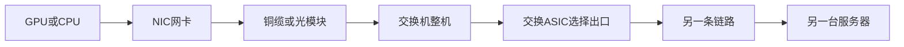
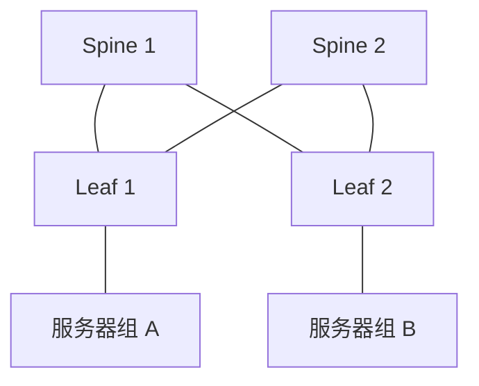

# 产品在数据中心里做什么

[返回学习地图](../README.md)

**阅读前提：** 本篇开始涉及产品型号与技术参数。第一次接触这些产品，建议先读[《从零认识 Marvell》](00_beginner_introduction.md)，建立服务器、交换机、芯片与光模块之间的关系。

## 从一条数据路径理解产品

交换ASIC像高速分拣中心：读取目的地址等信息，查表、排队，再从合适的端口转发。拥塞时，排队策略和与网卡协同的流量控制决定设备是否在等数据。DSP和retimer则主要解决信号传输质量，不承担同样的转发决策。

整机内通常还包括控制CPU、内存、供电、散热、连接器及软件。固定盒式交换机可能以一颗主要交换ASIC实现，模块化机箱可能有多颗线卡与fabric芯片。**“每台一颗”必须按具体设备确认。**

## 再往芯片里面看：SerDes、PHY 与转发核心

**SerDes 是高速串并转换及相关收发电路；PHY 是物理层功能的称呼，SerDes 通常是其中一部分。** PHY 既可能指芯片内的功能，也可能指独立销售的器件，不能假设它必然在交换芯片外、每端口一颗。

数据进入交换芯片后，还要经过编码恢复／纠错、以太网帧收发、解析查表、内部搬运以及必要的缓存与调度。信号质量、包处理能力和拥塞管理分别影响性能，仅看总带宽不足以判断实际表现。

**零基础请接着读：[《拆开交换芯片：SerDes、PHY 与性能》](02a_inside_switch_chip.md)。** 该节按“为什么需要串行传输 → PHY 与 SerDes 的关系 → 一份数据如何经过芯片 → 其他关键部件 → 性能与市场计数”展开，并附官方原理与产品资料。读完再继续下面的网络地图和型号表。

## 五张网络地图

| 网络用途 | 连接什么 | 重点需求 | Marvell研究入口 |
|---|---|---|---|
| 前端front-end | 应用服务器、存储、服务入口等 | 通用流量、可运营性、成本与多租户 | Teralynx；按业务量与服务器端口建模 |
| AI后端scale-out | 多个GPU节点／计算域 | 集体通信、低拥塞、有效吞吐 | Teralynx以太网；与InfiniBand等比较 |
| scale-up | 紧密协作的一组加速器及资源 | 更低时延、协议语义、内存访问等 | PCIe交换、特定以太网scale-up方案、光互连；逐架构识别 |
| DCI／scale-across | 不同机房、园区或数据中心 | 距离、光损耗、时延和带宽 | coherent DSP、模块及相关网络产品 |
| 管理网络OOB | BMC、设备管理口 | 独立运维、可靠性、较低速率 | 特定Prestera产品等 |

前端不严格等于南北向流量，后端也不是所有东西向流量。存储流量可能独立组网，也可能共网。分类应按客户的物理fabric和BOM，而非只按宣传名称。[交换产品][S04] [系统方案][S15]

## 最值得认识的产品

| 产品 | 作用与典型位置 | 截止日公开状态 | 测算单位 |
|---|---|---|---|
| Teralynx 7 | 12.8Tbps以太网交换，ToR/leaf/spine等 | 官网列示 | ASIC颗数×净ASP |
| Teralynx 10 | 51.2Tbps以太网交换，云与AI集群 | 2024-07公告量产 | 按51.2T一代及实际SKU |
| Teralynx T100 | 102.4Tbps以太网交换，覆盖前后端及scale-up应用 | 2026-06公告，称当季开始送样；未据此认定量产 | 按认证／爬坡情景单列 |
| Prestera 3500 | 较低速率的数据中心管理交换 | 官网列示 | 管理设备数或管理端口 |
| Structera S 50256 | PCIe 5.0、256 lane，设备间连接 | 相关公告称PCIe 5.0产品可用 | 服务器／域BOM中的芯片数 |
| Structera S 60260 | PCIe 6.0交换，260 lane | 2026-03公告，计划自然年Q3送样 | 按PCIe拓扑和数据lane需求 |
| Structera S 30260 | CXL 3.x交换，内存池连接 | 2026-03发布资料；量产需进一步验证 | 内存池／主机及拓扑 |

来源分别为[产品页][S04]、[Teralynx 10量产][S05]、[T100公告][S06]、[PCIe公告][S08]和[CXL说明][S09]。60260的260 lane包括256条数据lane及4条管理lane；不能当作260个网络端口。[PCIe说明][S30]

**公开网页更新不同步。** 概览页仍可能保留旧带宽范围，新闻页已有新一代产品。产品存在、送样与量产是三种状态；应以SKU、带日期公告、供货确认和客户认证逐项核验。

## 周边互连产品

| 类型 | 示例 | 解决的问题 | 容易混淆的地方 |
|---|---|---|---|
| 外置以太网 PHY／retimer／gearbox | Alaska C | 高速电连接的信号恢复、通道适配等 | 一颗可支持多个端口／通道；与交换 ASIC 内集成的 PHY 功能分开计数 |
| PAM4光DSP | Spica 800G、Nova 1.6T、Ara 1.6T | 光模块内的高速信号处理 | Marvell卖芯片，不等于整个光模块收入归它 |
| AEC DSP | Alaska A 800G／1.6T | 有源铜缆内恢复信号、延长可用距离 | AEC线缆与DSP颗数需按两端BOM数 |
| PCIe retimer | Alaska P | 恢复板级或线缆PCIe/CXL信号 | retimer不是PCIe switch |
| coherent DSP | Orion、Canopus、Deneb等 | 较长距离光纤传输的相干信号处理 | DCI端口不等于机房内所有光端口 |

来源：[PAM4 DSP][S10]、[Alaska A][S11]、[Alaska P][S31]、[coherent DSP][S12]。产品功能与实际可销售地域、客户认证是不同问题。

## 800G和51.2T分别是什么

- 800G一般指一个链路／端口的标称速率，单位Gb/s。51.2T指交换芯片容量，单位Tb/s。
- 在统一为单方向聚合容量后，64×800Gb/s＝51.2Tb/s；128×800Gb/s＝102.4Tb/s。这是容量算术，不保证某个整机具备这些前面板接口。
- 厂商有的强调full-duplex，有的把收发相加。采数时保留原始定义，再统一口径，**不要额外乘二**。
- 电气lane是串行通道；port是逻辑连接或物理接口，可由一条或多条lane组成。PCS逻辑lane和电气lane也不一定一一对应。512 radix不能读成512个1.6T端口；详见[芯片内部入门](02a_inside_switch_chip.md)。
- 800G是通信速度，800VDC是供电电压，数字相同没有换算关系。

## Leaf–spine怎么搭起来

Leaf接服务器，spine连接leaf，形成多条路径。ToR描述交换机在机柜顶部附近，leaf描述拓扑角色，两者不能相加算两台设备。上行总带宽小于下行总带宽时存在超售，比如2:1意味着下行需求可能是上行容量的两倍。

集群变大不一定按固定“每GPU几台交换机”增长。高radix可减少层级，多平面可以拆分带宽，新增第三层会增加设备和光链路。必须画出实际端口分配，再数设备。

## 具体系统示例

NVIDIA GB300 NVL72参考配置把72块GPU集中到一个机柜，9个NVLink交换托盘、每托盘2颗NVSwitch构成紧耦合连接，同时另有以太网或其他网络接入。该配置机柜功率上限142kW。[NVIDIA参考架构][S24]

这个例子帮助理解“一个机柜有不止一种交换功能”。它不证明NVSwitch可由Teralynx直接替换，也不应把18颗NVSwitch计入merchant以太网交换ASIC市场。

[S04]: https://www.marvell.com/products/data-center-switches.html
[S05]: https://www.marvell.com/company/newsroom/marvell-teralynx-512t-ethernet-switch-enters-volume-production-for-global-ai-cloud-deployments.html
[S06]: https://www.marvell.com/company/newsroom/marvell-announces-102-4-tbps-ai-cloud-data-center-switch.html
[S08]: https://www.marvell.com/company/newsroom/marvell-260-lane-pcie-6-switch-ai-data-center-scale-up.html
[S09]: https://www.marvell.com/blogs/structera-s-scaling-the-ai-memory-wall-with-cxl-switching.html
[S10]: https://www.marvell.com/products/pam-dsp.html
[S11]: https://www.marvell.com/products/ethernet-phys.html
[S12]: https://www.marvell.com/products/coherent-dsp.html
[S15]: https://www.nvidia.com/en-us/networking/spectrumx/
[S24]: https://docs.nvidia.com/enterprise-reference-architectures/nvl72-ai-factory/latest/components.html
[S30]: https://www.marvell.com/blogs/pcie-switching-ai-scale-up-networks.html
[S31]: https://www.marvell.com/company/media-kit/marvell-alaska-p-pcie-retimer.html
