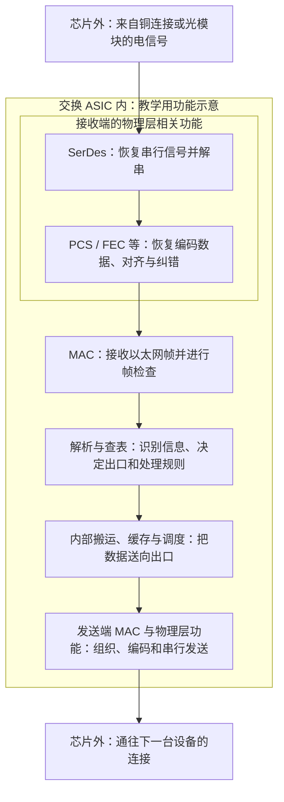

# 拆开交换芯片：零基础理解 SerDes、PHY 与性能

[返回学习地图](../README.md) · [上一层：产品在数据中心里做什么](02_products.md) · [完全零基础先读这里](00_beginner_introduction.md)

**本篇属于第 02 章的延伸，建议在知道“交换机里面有交换芯片”之后阅读。** 核查日期：2026 年 9 月 20 日。先读第 1–4 节理解工作原理，再读后面的性能和市场含义；无需背英文全称。

先记住这三个分工：**SerDes 帮芯片高速收发串行信号；PHY 是实现物理连接的一组功能，SerDes 通常是其中的一部分；转发核心根据数据包的信息决定出口。** PHY 功能可以集成在交换芯片里，也可以分布在外置器件和模块里，不能默认它是一颗额外芯片。[以太网接口架构][S33] [物理层划分][S39]

## 1. 为什么芯片需要 SerDes？从“很多位一起处理”到“排队传出去”

### 先理解“位”和“信号”

计算机里的信息可以表示为 0 和 1。每一个 0 或 1 叫一位，英文 bit；8 位组成一个字节，英文 Byte。文字、图片和 AI 计算结果，最终都可以变成这些数字。

但线路上跑的不是写出来的“0”“1”，而是代表它们的电信号。使用光纤时，还需要光电器件把信息转换成光信号。

### 芯片内部和对外连接，适合的工作方式不同

芯片内部常一次处理很多位，可以想成“多列同时工作”。如果把这些列全部用独立导线引到另一颗芯片，连接数量、占用空间和各路信号到达时间的协调都会很难处理。

一种办法是：**把一组并行数据按顺序变成高速串行数据传出去，到接收端再恢复成并行数据。** 负责这个转换的电路叫 **SerDes**，名称来自 Serializer / Deserializer，即串行器／解串行器。[接口实现示例][S33]

下面只是演示顺序，实际接口一次处理的数据更多，也可能使用多条串行通道：

```text
发送芯片内部：同时拿到一组数据 [1 0 1 1]
                         ↓ 串行器
一条串行通道：按时间顺序发送    1 → 0 → 1 → 1
                         ↓ 接收端解串行器
接收芯片内部：恢复成一组数据   [1 0 1 1]
```

这个过程没有压缩信息，也不负责选择目的地。芯片可以同时拥有很多条这样的通道，称为 **lane**。一条高速电气通道通常使用差分信号，也就是两根导线共同表达一个信号；不要把“一条 lane”机械理解成“一根线”。

**SerDes 的作用可以记成：让芯片内部适合并行处理的数据，通过有限数量的高速通道进出芯片。** 它通常是芯片内的电路模块，不是交换机面板上的插口。

## 2. PHY 和 SerDes 到底是什么关系？

**PHY 是 physical layer 的简称，即物理层。** 它解决的整体问题是：两端怎样按约定，把数据变成可传输的信号，并在另一端恢复出来。

在以太网里，物理层不仅涉及串并转换，还涉及数据编码、多通道对齐、适用的纠错机制，以及连接介质需要的收发功能。SerDes 主要承担其中高速串行收发的部分。[物理层划分][S39]

### 特别容易混淆的是：PHY 有两种常见用法

| 资料里的说法 | 它在说什么 | 能否直接当成一颗单独销售的芯片？ |
|---|---|---|
| “芯片集成 PHY”“PHY 功能” | 一组负责物理连接的功能模块 | 不能，可能已经在交换 ASIC 内 |
| “外置 PHY”“采购 PHY 芯片” | 一颗承担物理层相关功能的独立器件 | 可以是单独产品，但要核对实际型号、数量和配置 |

此外，芯片设计资料中的“SerDes PHY”有时指较窄的高速收发电路；完整以太网 PHY 则还涉及其他物理层功能。**看到 PHY，先问清功能边界和集成位置。** 不同供应商的方框命名并不完全一致。[以太网接口架构][S33]

两种可能的实现方式，可以这样理解：

- **直接连接方案：** 交换芯片内的高速电接口，经电路板连接到适配的铜缆或光模块，某些方案不需要额外的板级 PHY 芯片。
- **增加外置器件的方案：** 在交换芯片与连接口之间增加 PHY／retimer 等器件，完成特定介质适配、信号恢复或通道转换。增加它是否必要，要看距离、损耗、速率和功能需求。

Marvell 的 Alaska C 产品就是独立以太网 PHY／retimer／gearbox 的实际例子。其中 **retimer** 恢复信号时序后重新发送；**gearbox** 可以在不同通道数量或每通道速率之间做适配。它们可以集成在同一器件中，并不是每个名字都对应额外一颗芯片。[Marvell PHY 产品][S11]

<details>
<summary>可选：产品框图里的 PCS、PMA、PMD 分别是什么？</summary>

- **PCS，物理编码子层：** 按协议整理数据的编码、同步等；高速多通道方案还涉及通道对齐。
- **PMA，物理介质连接子层：** 涉及串并转换及通道适配等功能，和 SerDes 关系密切。
- **PMD，物理介质相关子层：** 对应具体电或光介质的收发要求。
- **FEC，前向纠错：** 在适用标准中帮助恢复传输错误；具体子层安排随标准变化。

这是功能划分，不是三四颗必然分开的芯片。完整光链路的物理层功能可跨交换芯片、模块和光电器件实现。**MAC 属于 PHY 上方的数据链路功能，不应画成 PHY 的子模块。** [AMD 分层说明][S39]

</details>

## 3. SerDes 为什么很难做好？“快”还必须“听得清”

当电信号通过芯片封装、电路板走线、连接器和铜缆时，会衰减、失真，也会受到相邻信号干扰。速度越高，每次判断信号的时间越短，接收端更难分清原始信息。

现代高速 SerDes 因而不仅是一个简单的“排队器”，还需要收发和信号恢复电路。先认识两项关键工作：

| 功能 | 零基础理解 | 做不好会怎样？ |
|---|---|---|
| 均衡，equalization | 补偿传输通道造成的失真，尽量把挤在一起、模糊的信号分开 | 判断错误增多，某些距离或线路无法稳定使用 |
| 时钟与数据恢复，CDR | 从收到的信号中找准“什么时候读”，像重新找回节拍 | 读得过早或过晚，可能把数据判错 |

二者需要配合：波形更清楚有助于找准节拍，节拍更准确也有助于恢复数据。[均衡与 CDR 原理][S34]

你还会看到 **PAM4**：它用四种信号电平表示四种状态，每个符号可携带 2 位信息；常见的 **NRZ** 用两种电平，每个符号携带 1 位。这里的“符号”就是一次信号状态。PAM4 能提高每次信号状态携带的信息量，但在相同总幅度下，电平之间更接近，对信号质量要求更高。[PAM4 与高速链路][S37]

因此，评价 SerDes 要同时看：**速率、适用通道的损耗／距离、误码情况、功耗，以及与对端设备的兼容性。** “支持更高 G”不自动等于在任意电路板或线缆上都稳定工作。误码率 BER 就是收到的数据位里有多少比例判错；比较时必须说明测试通道、温度和是否经过纠错。

## 4. 跟着一份数据走进交换芯片

下面画的是**接收一个以太网端口的数据，再从另一个端口发出**的功能流程。假设到达芯片引脚的已经是电信号；光电转换发生在相应光器件中。



图中把 PCS/FEC 合并，是为了先理解功能；接收端各项操作的具体顺序随标准和实现变化。缓存、调度和内部搬运也可能分布在不同位置，这张图不代表 Teralynx 的精确内部布线或固定处理顺序。

### PCS：让连续传来的数据重新有组织

收到的信号不能直接当成业务内容使用。PCS 帮助恢复规定的编码和同步；多个通道一起传输时，还需要把到达时间有差异的数据对齐。可以把它理解成“把拆开运输的材料按约定重新整理”。

### FEC：用额外信息修复一定范围内的传输错误

发送端加入冗余的纠错信息，接收端据此纠正一定范围内的错误。这叫 **前向纠错 FEC**。它提高可靠性，但也需要额外的传输和处理资源，会带来处理时延；错误超出能力时仍可能无法恢复。[FEC 机制][S37] [FEC 与时延研究][S38]

**FEC 处理的是传输错误，不能修复因为出口拥塞而被交换机丢弃的数据包。** 它也不能把损坏的线缆“无限救回来”。某种高速链路是否需要 FEC、使用何种模式，要按相应标准和两端配置确认。

### MAC：以一帧数据为单位收发和检查

**MAC 是媒体访问控制功能。** 在以太网里，一份按规定格式封装的数据叫“帧”，可以先把它理解成装着数据和地址信息的信封。MAC 负责以太网帧的收发及有关检查；它通常用 **FCS 帧校验**检查数据是否出错。FCS 检查本身不负责纠错。[MAC 接收检查][S36]

**选择交换机的哪个出口，主要由后面的解析、查表和转发逻辑完成。** 不要把 MAC、PHY 或 SerDes 单独当成整个交换芯片的“决策大脑”。

## 5. 除了 SerDes/PHY，还有哪些部件影响性能？

现在从“数据能否传进来”，继续看“进来以后怎么处理”。以下是通用功能解释，不表示所有型号都采用完全相同的实现。

| 功能部件 | 可以怎样理解 | 主要影响什么 |
|---|---|---|
| 解析器与转发流水线 | 读取信封上的信息，按一系列步骤执行规则 | 支持哪些协议和处理功能；每秒能处理多少包；处理时延 |
| 查找表及其存储资源 | 保存“遇到这个地址或规则，应如何处理”的目录 | 可容纳多少地址、路由和过滤规则；不同表之间如何分配资源 |
| 内部交换互连 | 在芯片内部把数据从入口搬到目标出口，常称内部 fabric | 多个端口同时工作时，内部是否有瓶颈 |
| 包缓存，packet buffer | 暂存一时发不出去的数据 | 吸收短暂流量突增的能力，以及排队、丢包情况 |
| 队列与调度器 | 把等待的数据分类，决定下一份先发谁 | 不同业务怎样分享出口，重要或延迟敏感流量等待多久 |
| 拥塞反馈与流量管理 | 发现出口变忙后，通过标记、流控等机制与发送端配合 | 减少持续积压；具体效果依赖网卡、协议和配置 |
| 遥测与计数器 | 记录拥塞、错误、队列状态等，像设备的仪表盘 | 能否发现短暂故障、找出瓶颈并调整网络 |

**查找表存的是“规则”，包缓存存的是“等待转发的数据”，两者虽然都用存储资源，但用途不同。** 看到 SRAM、TCAM 等名字时，先确认它们用于哪项功能，无需现在学习电路细节。

Marvell 的 Teralynx 10 官方框图实际列出了 SerDes、PCS/FEC、Ethernet MAC、转发、内部互连、包缓存、服务质量管理和遥测等模块。这是这些部件出现在真实产品里的证据；它不证明厂商的领先性能宣传，也不提供所有模块的独立实测结果。[Teralynx 10 产品简报，第 1 页][S32]

还有几项不能从芯片方框图上忽略：

- **封装、走线、连接器与时钟。** 它们会影响信号损耗、干扰和时间稳定性。芯片接口支持某速率，整机仍需要相应设计与验证。
- **供电和散热。** 功耗、温度和电源稳定性会约束系统能否在目标配置下可靠运行。
- **控制 CPU、固件和软件。** 它们负责配置、管理、协议和异常处理；正常高速转发通常由专用硬件完成，并不是每个包都交给通用 CPU。软件能否正确启用芯片功能，也影响实际使用效果。

前两项属于芯片与整机共同的设计问题，不能只归功于 SerDes。[接口集成与系统设计][S33]

## 6. 用三个例子，学会判断瓶颈

### 例子 A：接口标称很快，但连接不稳定

某条高速链路在一段短线缆上正常，换成损耗更大的线路后错误增多。应检查通道质量、连接器、SerDes 均衡、时钟恢复和 FEC 状态；不能仅凭“端口支持这个速度”判断链路合格。

更大的包缓存不会把失真的电信号恢复清楚。需要先分清这是传输质量问题，还是业务流量造成的拥塞。

### 例子 B：四个入口，挤向一个出口

假设四个入口各以 100Gb/s，持续向同一个 100Gb/s 出口发送数据。忽略协议开销，需求是出口能力的四倍。即使 SerDes 完全没有误码，出口也发不完。

短暂突发可以先放进缓存；如果持续进入的速度高于流出的速度，有限缓存最终会耗尽，或触发流控、丢包等处理。**加缓存可以争取时间，但不会把这个出口变成 400Gb/s。** 队列已经很长时，还会增加等待。[缓存与拥塞原理][S35]

因此需要结合出口带宽、流量分配、调度及发送端拥塞控制来解决。不是“缓存越大，所有情况下越快”。

### 例子 C：总带宽相同，小包处理压力不同

同样搬运一批数据，分成很多小包，比装成少数大包需要执行更多次解析、查表和调度。于是除了 Tb/s，还需要看**每秒可处理多少包**，以及测试包长和开启了哪些功能。

也要分清“空载时的最低时延”和“忙碌时绝大多数包的时延”。客户实际关心的是任务完成速度、稳定性和最慢的一部分流量，不只有规格表上的最小数字。

<details>
<summary>可选：cut-through 和 store-and-forward 为什么影响时延？</summary>

**Cut-through，直通转发：** 收到足够的头部信息后，就可能开始向出口转发，无需等完整帧全部到齐。**Store-and-forward，存储转发：** 先接收完整帧，再转发。

前者有机会减少等待，但不能因此认为整帧校验已经完成，也不能绕开 FEC、速率适配或拥塞产生的全部时延。产品间比较必须统一转发模式、帧长、FEC 配置及测量起止点。Teralynx 10 简报列有这两种模式。[产品简报][S32] [FEC 时延研究][S38]

</details>

## 7. 现在怎样读 112G SerDes、800G 端口和 51.2T 芯片？

它们在讲不同层级：**SerDes 看每条高速串行通道；端口看一组通道组成的连接；芯片总容量看所有相关端口的汇总能力。**

为了建立直觉，在统一的以太网标称速率口径下：

- 8 条每条承载约 100G 以太网速率的通道，可以组成一个 800G 连接。
- 换成每条约 200G 的方案，4 条就可以组成 800G；前提是两端和相应接口支持。
- 64 个 800G 端口的单方向聚合容量是 51.2Tb/s。

但不能直接把“112G SerDes”乘 8，得出“896G 用户数据”。112G 可以是收发技术的速率等级名称；例如一类 100G 以太网电气通道实际线路速率为 106.25Gb/s，包含编码、纠错等开销。应用能使用的有效数据速率还受帧和更上层协议等开销影响。[112G 与线路速率][S37]

这几组算术用于理解层级，不代替具体 SKU 的端口组合。**电气 lane 数、PCS 内部逻辑 lane 数、光纤数和面板插口数，也不能直接画等号。** 更快的每通道速率可减少某些连接所需的通道数量，但可能增加信号处理难度，整体成本和功耗仍需实测比较。

## 8. 这对理解 Marvell、测算市场有什么用？

| 研究对象 | 正确计数思路 | 需要避免的重复统计 |
|---|---|---|
| Teralynx 交换 ASIC | 按实际芯片型号、颗数和成交价 | 芯片内集成的 SerDes、MAC、缓存不能再分别当成独立芯片销售额加一次 |
| 外置以太网 PHY／retimer／gearbox | 按设备实际采用的独立器件和型号计算 | 不能假设每个端口必配一颗；一颗器件也可能服务多个端口或通道 |
| 光模块中的 DSP | 按模块架构和实际物料计算 | 不能与交换芯片内 SerDes 混为一类；也不能把整个光模块金额当 DSP 收入 |
| SerDes 设计 IP 授权 | 如果客户明确研究这一市场，另按授权／版税口径 | IP 是可复用的芯片设计模块，其授权市场不等于最终芯片销售市场 |

Marvell 同时提供集成高速接口的交换芯片，以及外置 PHY 和互连芯片。这些能力可以互相配合；具体客户是否采用同一家供应商的组合，需要逐产品验证。[交换产品简报][S32] [PHY 产品目录][S11]

和客户讨论性能时，可以把问题问得很具体：

1. “您希望提升的是单端口速度、整颗芯片容量，还是拥塞时的实际任务表现？”
2. “这个 SerDes 速率是在什么距离、线路损耗、温度和纠错配置下验证的？”
3. “PHY 功能哪些在交换芯片里，哪些依靠外置芯片或光模块？”
4. “时延、功耗和吞吐量采用什么包长、流量模式、端口配置和测量范围？”
5. “我们测算的销售对象是交换 ASIC、外置 PHY，还是光 DSP？能否提供典型配置的物料清单？”

## 9. 读完应能回答的四个问题

- **SerDes 和 PHY 是两个并列的独立零件吗？** 不是这种固定关系。SerDes 通常实现 PHY 的一部分功能；实际集成方式和命名口径需要核实。
- **SerDes 决定数据包发给哪台服务器吗？** 不负责这种转发决策，主要由解析、查表和转发逻辑完成。
- **更强的 FEC 能解决出口被流量挤满吗？** 不能，传输误码和拥塞丢包是不同问题。
- **芯片容量相同，实际性能就一定一样吗？** 不一定，还要看包处理能力、规则资源、缓存与调度、信号质量、功耗和软件等。

下一步回到[第 02 章的产品表与网络地图](02_products.md)，再看[技术趋势](04_trends.md)或[市场规模方法](06_market_sizing.md)。

---

**来源使用说明：** 产品事实来自厂商公开资料；分工比喻、流程图和瓶颈例子为教学解释。通用原理不代表任一 Teralynx 型号的全部内部实现。本文没有用厂商宣传代替同条件性能测试。来源编号对应[来源目录](09_sources.md)。

[S11]: https://www.marvell.com/products/ethernet-phys.html
[S32]: https://www.marvell.com/content/dam/marvell/en/public-collateral/switching/marvell-teralynx-10-data-center-ethernet-switch-product-brief.pdf
[S33]: https://www.synopsys.com/articles/integrated-400g-800g-ethernet-ip.html
[S34]: https://www.mathworks.com/help/serdes/ug/model-clock-recovery-loops.html
[S35]: https://www.cisco.com/c/en/us/products/collateral/switches/nexus-9000-series-switches/white-paper-c11-738488.html
[S36]: https://docs.amd.com/r/en-US/am011-versal-acap-trm/MAC-Receiver
[S37]: https://cdn.teledynelecroy.com/files/whitepapers/an-lt-testing-for-112g-serdes.pdf
[S38]: https://www.repository.cam.ac.uk/items/db710919-ddb6-49d2-bf3f-eb7fe5c7f05f
[S39]: https://docs.amd.com/r/en-US/pg051-tri-mode-eth-mac/PCS-PMA-and-PMD
