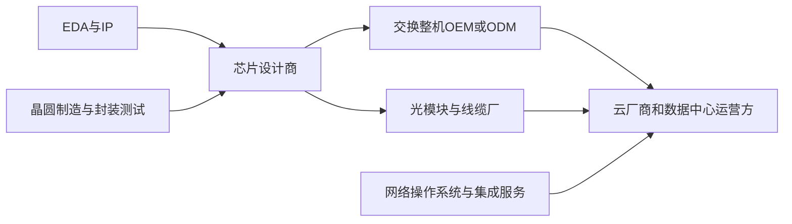

# 产业链、采购者与竞争格局

[返回学习地图](../README.md)

## 先把价值链分层

Marvell、Broadcom等提供芯片。交换机OEM提供品牌设备及软件支持，ODM可能为云厂商按指定方案制造设备。光模块厂把DSP、光器件等组合为可插拔模块。云厂商网络架构团队通常影响协议、芯片和软件选型，采购订单则可能通过ODM、分销或其他实体流转。因此“谁付款”“谁决定”“谁使用”要分别记录。

设备在中国制造并不代表最终部署在中国；公司财报按发货地披露也不能直接视为中国终端需求。[Marvell年报地域口径][S01]

## 下游为什么买

| 客户类型 | 主要任务 | 采购侧重点 | 适合访谈的人 |
|---|---|---|---|
| 大型云厂商 | 大规模云与自有AI平台 | 性能、每比特功耗、定制能力、供应连续性 | 网络架构、硬件设计、采购 |
| AI云／新型算力服务商 | 训练及推理集群 | 上线速度、GPU利用率、可交付系统 | 集群架构、基础设施负责人 |
| 企业／研究机构 | 私有云、HPC、AI业务 | 软件、运维、互操作、渠道支持 | IT架构、集成商 |
| 交换OEM／ODM | 把芯片做成可用系统 | SDK、认证、板级设计、成本、交期 | 产品经理、硬件工程、供应链 |
| 光模块／线缆厂 | 高速链路 | DSP性能、功耗、兼容和良率 | 光电研发、产品及采购 |

托管机房业主常提供电力、场地和冷却，未必采购租户的AI网络。访谈要区分资产业主和IT运营商，避免把同一批设备重复计入两类客户。

## 已核实的市场锚点

| 口径 | 数值 | 含义 |
|---|---:|---|
| 2025全年全球数据中心以太网交换整机收入 | 325亿美元 | IDC估计，同比增长53.5% |
| 2026 Q2同口径单季收入 | 123亿美元 | IDC估计，同比增长64.5% |
| 2026 Q2 800G收入占数据中心以太网交换收入 | 41.2% | 收入结构，不能当端口数量占比 |
| 2026 Q2品牌数据中心以太网收入份额 | NVIDIA 20.4%、Arista 18.7%、Cisco 18.2% | 同一IDC季度同一市场口径 |

来源：[IDC年度][S17]、[IDC最新季度][S18]。这些是整机市场观察，不能从表中给Marvell或Broadcom填写ASIC份额。整机的服务、软件、光模块是否纳入，应索取tracker定义表确认。

Dell’Oro对2026 Q1 AI后端的公开摘要称以太网约占该类交换销售额的三分之二，并把Celestica排在当季以太网AI集群交换销售前列。[Dell’Oro][S19] 这与IDC的“全部数据中心以太网、品牌厂商”不是同一范围，不能直接比较排名，更不能把销售额占比当作采用以太网的GPU数量占比。

## 芯片层与系统层分别看竞争

| 层级 | 主要比较对象 | 应当比较什么 |
|---|---|---|
| 数据中心以太网交换ASIC | Marvell Teralynx、Broadcom Tomahawk、Cisco Silicon One；NVIDIA自有交换芯片和系统构成重要竞争约束 | 容量、radix、拥塞控制、功耗、SDK、量产、实际可采购性 |
| 完整以太网系统 | NVIDIA、Arista、Cisco、HPE/Juniper、Huawei，以及ODM生态等 | 端到端性能、软件支持、客户关系、交付和价格 |
| PCIe／scale-up交换 | Marvell Structera S、Astera Scorpio及相关协议方案 | lane、协议、时延、主机兼容、实际加速器配置 |
| 光与铜互连 | DSP、retimer、模块、AEC、CPO各自的供应商 | 必须按器件层级和应用距离分池，不能用一个排名代替 |

定位依据：[Broadcom][S13]、[Cisco][S14]、[NVIDIA][S15]、[Astera][S16]及Marvell产品资料。这里没有给出无法从公开来源核实的芯片市占率。

Broadcom已公告Tomahawk 6于2026年3月量产；Marvell T100在6月公告当季送样。评价竞争时，上市时间和客户验证进度与规格同样重要。Cisco G300的2月公告把首次系统可用目标设在2026下半年，仍应另查实际交付。[Broadcom][S13] [Marvell][S06] [Cisco][S14]

## 为什么切换芯片供应商不容易

研究判断：芯片本身只是一部分。SDK和网络操作系统适配、遥测、稳定性验证、网卡及光模块互操作、现场运维和供应保障都存在切换成本。SONiC等开放软件降低部分依赖，但不会自动消除认证和调优工作。Marvell提供SAI/SONiC支持是切入条件之一，不足以单独证明份额会提升。[Teralynx资料][S04]

把竞争问题问成“在什么客户、什么代际、什么网络层、什么约束下有机会替换”，比问“谁的芯片最好”更能指导SAM和收入预测。

[S01]: https://investor.marvell.com/sec-filings/all-sec-filings/content/0001835632-26-000011/mrvl-20260131.htm
[S04]: https://www.marvell.com/products/data-center-switches.html
[S06]: https://www.marvell.com/company/newsroom/marvell-announces-102-4-tbps-ai-cloud-data-center-switch.html
[S13]: https://investors.broadcom.com/news-releases/news-release-details/broadcom-now-shipping-worlds-first-1024-tbps-switch-production
[S14]: https://blogs.cisco.com/sp/cisco-silicon-one-g300-the-next-wave-of-ai-innovation
[S15]: https://www.nvidia.com/en-us/networking/spectrumx/
[S16]: https://www.asteralabs.com/products/scorpio-smart-fabric-switch/
[S17]: https://www.idc.com/resource-center/blog/ethernet-switch-market-size-and-growth-datacenter-segment-surges-60-in-q4-as-ai-workloads-expand/
[S18]: https://www.idc.com/resource-center/blog/ethernet-switch-market-surges-43-4-to-18-9b-in-2q26-as-ai-infrastructure-demand-drives-record-datacenter-spending/
[S19]: https://www.delloro.com/news/ethernet-extends-lead-in-ai-scale-out-networks-despite-strong-infiniband-rebound/
