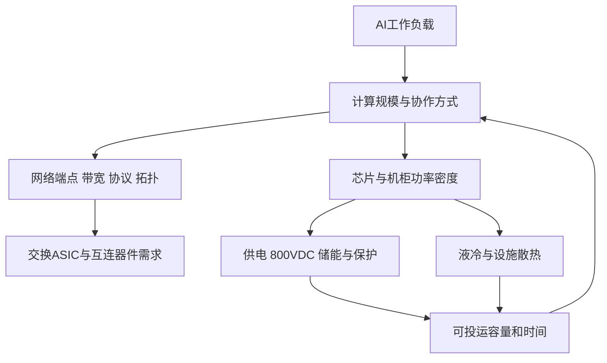

# 把六份电力和散热笔记接到网络研究

[返回学习地图](../README.md)

你的笔记可以直接构成“数据中心为什么受物理基础设施约束”的底座。需要补上的一层是：工作负载产生计算与通信需求，计算网络的具体架构再决定交换产品数量。

箭头表达分析关系，非固定比例。高压配电帮助供电，高效网络帮助算力利用，两者都服务于更多有效计算，但800VDC渗透率不能直接转成以太网交换芯片渗透率。

## 逐份如何使用

| 用户文件 | 可沿用的知识 | 对交换研究的用处 | 使用限制 |
|---|---|---|---|
| 01 Data Center Power and Electrical Infra Basics | 电网到芯片、电力连续性、设施MW与IT MW、冗余 | 校验部署容量和时间；讨论供电约束 | switchgear是电气设备；冗余不意味着IT负载翻倍 |
| 02 Data Center Cooling System Basics (Semi) | 热密度、DLC、CDU、设施排热、混合冷却 | 分辨网络功耗与可部署功率；理解液冷交换设备 | CFM/kW与设备容量是特定条件示例，不作统一系数 |
| 03 Why AI Data Center Are Moving to 800VDC (Personal) | P=VI、电流和铜、机柜空间、分阶段迁移 | 形成“算力密度→供电约束”的解释 | 密度分档非行业强制阈值；DC方案仍有转换损耗 |
| 04 NVIDIA 800VDC Architecture Key Notes | 机柜级功率、负载瞬变、储能时间尺度、DC保护 | 解释基础设施部署门槛和供电路线 | 厂商架构不是全行业标准；引用比例需检查基准 |
| 05 SemiAnalysis 800VDC Transition Notes | sidecar到上游整流、设备价值重新分配 | 学习按阶段／BOM测算的思路 | TAM与采用年份是笔记转述的机构预测，未独立核实原报告 |
| 06 Oxcap 800VDC Notes | 多架构共存、单位MW与单位机柜不同 | 借鉴分母和采购约束分析 | 其中不少数据转引SemiAnalysis，不能视作独立交叉验证 |

## 四个能直接接进模型的概念

**设施容量与IT容量。** PUE本质是同一边界及周期的总设施能耗÷IT能耗。规划时可把已可用设施MW除以设计PUE，近似得到IT功率预算，但要校准设计点、使用率和非IT负载。不能把全园区远期规划MW当本年投入使用的IT MW。

**机柜功率与GPU功率。** GPU TDP之外还有CPU、内存、网络、存储和供电损耗。若用“每GPU对应的全IT功率”换算GPU数，已包括的网络功耗不能再扣一次。

**密度与总量。** 固定IT MW下，机柜功率提高意味着机柜数可能减少。更高算力密度不保证交换机台数同比例增加，端口速度、GPU数和拓扑还会同时变化。

**效率与单位计算量。** 网络节电可能释放同一电力预算中的算力容量，也可能只减少电费。要知道客户是受功率上限限制还是需求限制，才判断如何反馈到部署量。

## 原笔记需要保留的限定与修正

1. **I²R不能直接变成全站节电比例。** 同为600kW时，54V约需11,111A，800V约750A。若电阻保持不变，导体损耗比为(54/800)²≈0.456%；实际导体会变细、路径和转换效率会改变，不能宣称全站节能99.5%。这是物理算例。
2. **N+1和2N表示供电能力／路径设计，不能把有效IT需求按同样倍数增加。** 网络冗余也要数实际多出来的端口和设备，不能自动乘电力冗余系数。
3. **储能功率和储能电量分开。** MW反映瞬时输出，MWh反映持续时间。笔记中的电容、BBU和设施储能分别应对不同时间尺度，不能把快响应容量当作长时备电。
4. **电压比例需保留接线和导体边界。** 笔记04中415VAC、480VAC、800VDC比较表使用取整数据，不能从显示值机械重算所有百分比。64:1变比对800V理想得到12.5V，也不能仅凭这一数值推定稳定输出恰为12V。
5. **待查的美国变压器存量比例。** 笔记04个人备注的“70%服役超过25年”和“20%备用容量”缺少可核对原始统计边界，本手册不把它们用于市场测算。
6. **付费研究预测单列。** 笔记05/06提到2028年sidecar约110亿美元、2030年SST约320亿美元、800VDC新增容量约39GW；目前仅作为待核实线索，不用于交换ASIC基准情景，也不视为本研究已验证结论。

## 截止日能用官方资料更新的部分

NVIDIA的GB300 NVL72参考架构确认特定机柜可达142kW并采用液冷，支持“密度上升使供电散热重要”的逻辑；不意味着全部AI机柜相同。[系统架构][S24]

2026年8月官方路线仍区分既有AC设施的混合改造、行级供电和未来设施级直流方案。power rack指向2026下半年，row power center指向2027，是路线目标而非已实现全行业普及率。[最新路线][S25] 因此不能把笔记05的四阶段年份当作每个客户必经的固定时间表。

## 和Marvell沟通时怎样用这些知识

可问：“客户的网络选型是否受机柜功率、液冷条件或部署交期限制？您希望测算的机会更多来自端口增加、速率升级，还是在固定电力预算下改善有效计算？”

把答案放回三个变量：**可投运计算规模、每台系统的网络配置、采用与交付时间**。这就是你的电力和散热知识对本项目最直接的贡献。

[S24]: https://docs.nvidia.com/enterprise-reference-architectures/nvl72-ai-factory/latest/components.html
[S25]: https://blogs.nvidia.com/blog/800-vdc-power-architecture-ai-factory/
